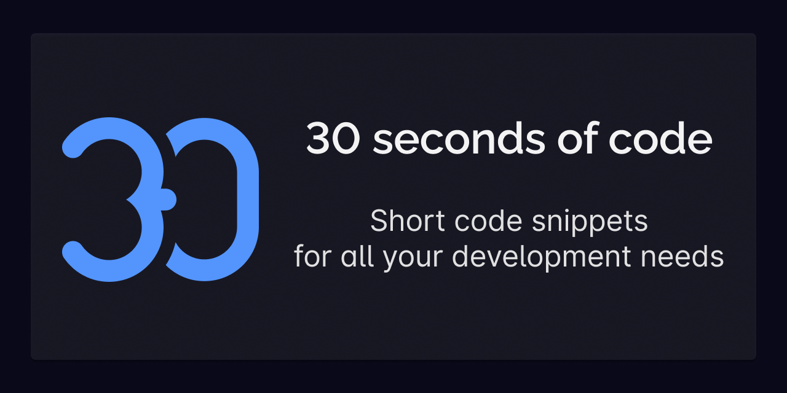

# Code Phỏng Vấn Cho JavaScript, CSS, Python và React.

Đây là repo về các mẫu code cho các câu hỏi và bài tập thường gặp khi phỏng vấn JavaScript, CSS, Python và React. Repo này được tổng hợp và dịch từ 30 Second of Code.

## Nguồn: 

- [javascript](https://github.com/30-seconds/30-seconds-of-code)
- [css](https://github.com/30-seconds/30-seconds-of-css)
- [react](https://github.com/30-seconds/30-seconds-of-react)
- [python](https://github.com/30-seconds/30-seconds-of-python)